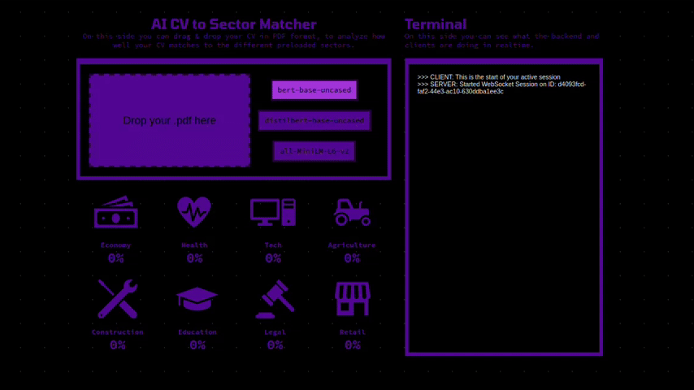

# Getting started.

AI CV to Sector Matcher.
This webbapp utilizes different text mining & nlp techniques including the parsing of pdf files, removal of stopwords, encoding of context embeddings and vector similarity formulas. A user can benefit from these implementations by using the web app to inform themselves about their CVs ranking compared to general descriptions of various sectors




## How to install.
There are 2 ways to install and run the required complete node.js server

### From the local repository (x86 only)

```
sudo apt update
sudo apt install nodejs npm python3 python3-pip python3-venv
python3 -m venv env
source env/bin/activate
npm install
node .
```

### From the Docker .tar image (platform independent)
```
docker load -i cvmatching.tar
```

## After installing
You can access the web app at http://localhost:4500.